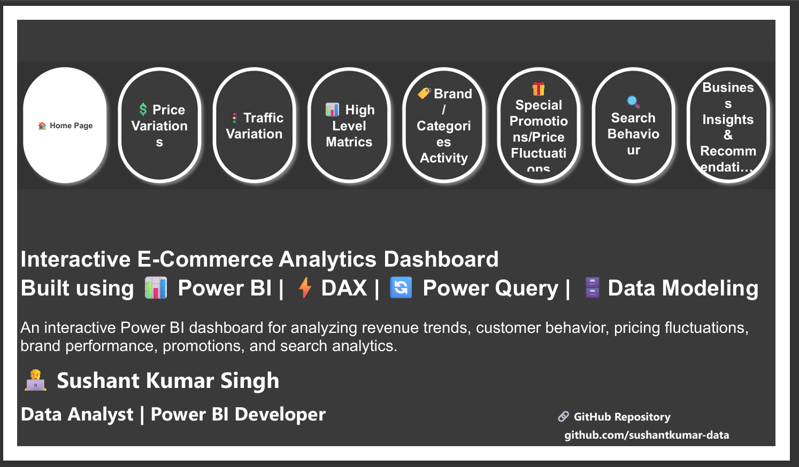
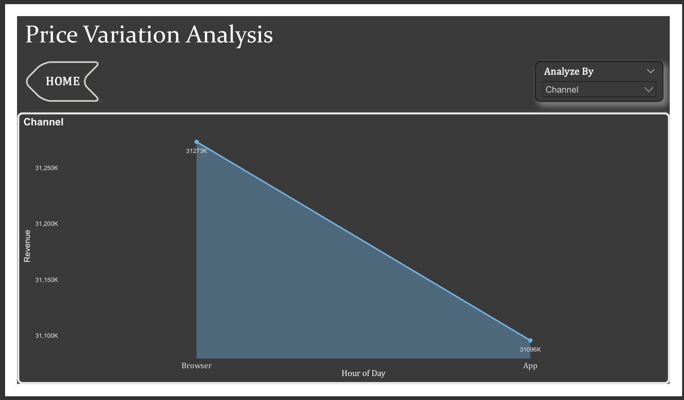
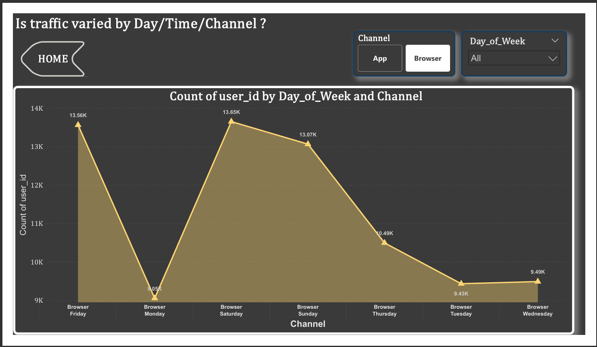
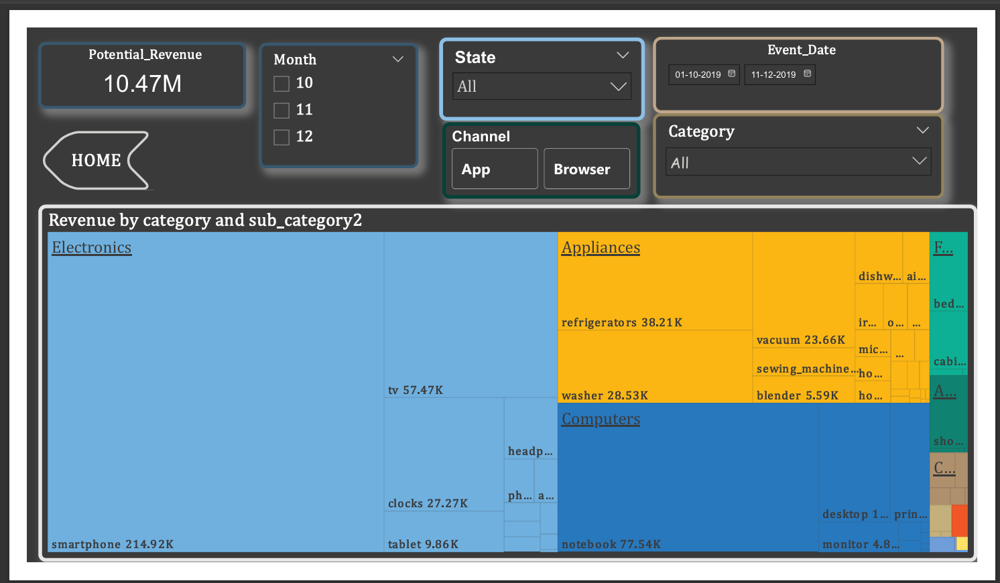
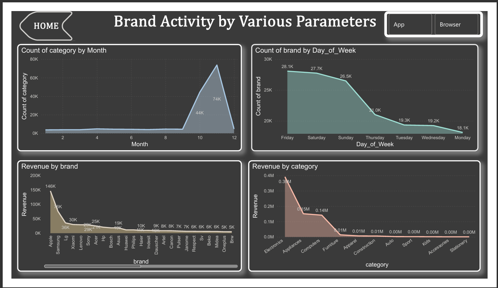
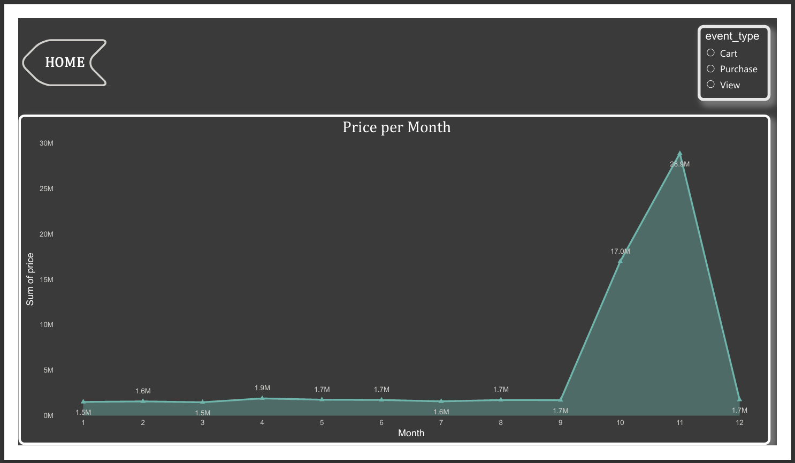
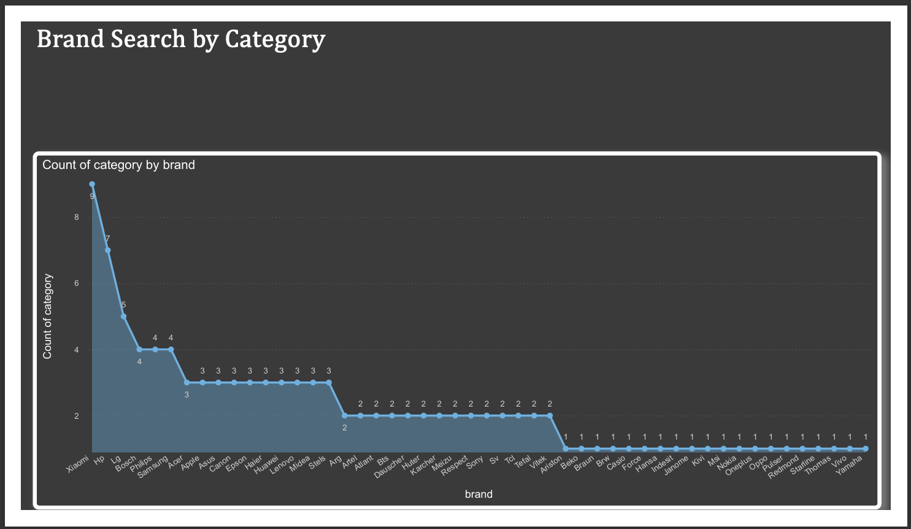
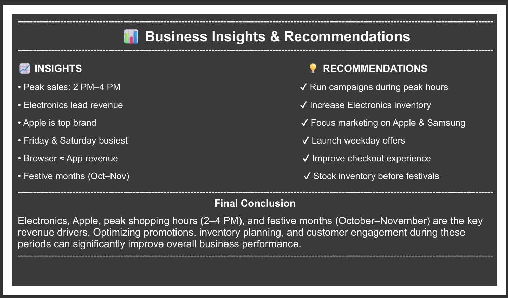

# 📊 E-Commerce Analytics Dashboard

## 📌 Project Overview
This project is an interactive Power BI dashboard built to analyze e-commerce sales, customer traffic, brand performance, promotions, and search behaviour. The dashboard helps identify business trends and supports data-driven decision-making.

---

## 🛠️ Tools & Technologies
- Microsoft Power BI
- DAX
- Power Query
- Data Modeling
- CSV Dataset

---

## 📈 Dashboard Pages
1. Home Page
2. Price Variation Analysis
3. Traffic Variation Analysis
4. High Level Metrics
5. Brand & Category Activity
6. Special Promotions / Price Fluctuations
7. Search Behaviour
8. Business Insights & Recommendations

---

## 🎯 Key Features
- Dynamic slicers
- Field Parameters
- Bookmarks & Navigation Buttons
- Interactive Charts
- KPI Cards
- Business Insights
- Professional Dashboard Design

---

## 💡 Business Insights
- Peak sales occur between **2 PM – 4 PM**.
- Electronics generate the highest revenue.
- Apple is the leading revenue-generating brand.
- Friday and Saturday record the highest traffic.
- Browser and App channels perform almost equally.
- Revenue increases significantly during October and November.

---

## 📂 Repository Contents
- Power BI Dashboard (.pbix)
- Dashboard PDF
- Dataset Files
- Dashboard Screenshots

---

## 👨‍💻 Author
**Sushant Kumar Singh**

Aspiring Data Analyst | Power BI | SQL | Excel | Python

---

# 📷 Dashboard Screenshots

## 🏠 Home Page

## 💲 Price Variation Analysis

## 🚦 Traffic Variation

## 📊 High Level Metrics

## 🏷️ Brand Analysis

## 🎁 Promotion Analysis

## 🔍 Search Behaviour

## 💡 Business Insights

